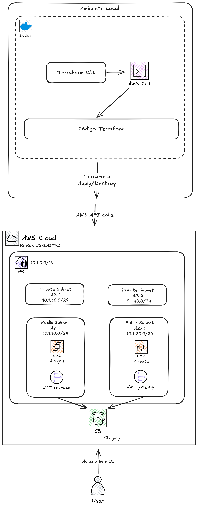

# Plataforma de Dados Moderna com Airbyte na AWS

Este projeto provisiona uma plataforma de dados moderna e escalável usando **Airbyte** para integração de dados, implantada na infraestrutura AWS EC2 usando **Terraform**. A infraestrutura inclui uma configuração VPC personalizada, armazenamento de dados de staging e implantação automatizada da instância do  Airbyte com todas as configurações necessárias de rede e segurança.

## 🏗️ Visão Geral da Arquitetura



### Componentes Principais

- **VPC**: Rede segura com sub-redes públicas/privadas em 2 zonas de disponibilidade
- **Instância EC2**: t3.xlarge executando a plataforma Airbyte
- **Bucket S3**: Área de staging para processamento e armazenamento de dados
- **Grupos de Segurança**: Configurados para acesso seguro à UI e API do Airbyte
- **Papéis IAM**: Permissões adequadas para interações entre EC2 e S3
- **NAT Gateway**: Acesso seguro à internet para sub-redes privadas

## 🚀 Início Rápido

### Pré-requisitos

1. **AWS CLI** configurado com credenciais apropriadas
2. **Terraform** >= 1.10.0 instalado
3. **Um bucket S3** para armazenamento do estado do Terraform
4. **Seu IP público** para acesso seguro ao Airbyte

### 1. Clonar e Configurar

```bash
git clone <url-do-repositorio>
cd di-airbyte-ec2-with-terraform/terraform
```

### 2. Configurar Backend do Terraform

Crie ou use um bucket S3 existente para o estado do Terraform:

```bash
aws s3 mb s3://seu-bucket-de-estado-terraform
```

Atualize `main.tf` com o nome do seu bucket S3:

```hcl
terraform {
  backend "s3" {
    bucket = "seu-bucket-de-estado-terraform"  # Atualize isto
    key    = "terraform/terraform.tfstate"
    region = "us-east-2"
  }
}
```

### 3. Configurar Variáveis

Crie `terraform.tfvars`:

```hcl
project_name = "airbyte-aws"
environment = "dev"
aws_region = "us-east-2"
vpc_cidr_block = "10.1.0.0/16"
instance_type = "t3.xlarge"
allow_ips = ["SEU.IP.PUBLICO.AQUI/32"]  # Seu IP para acesso seguro
```

### 4. Implantar Infraestrutura

```bash
# Inicializar Terraform
terraform init

# Planejar implantação
terraform plan

# Aplicar infraestrutura
terraform apply
```

### 5. 🚀 Instalação do Airbyte na EC2

Para que o Airbyte funcione corretamente na instância EC2, siga estes passos (execute como `ec2-user` ou o usuário padrão da sua AMI):

1. Acesse a pasta da private key:

```bash
cd ../keys
```

2. Conecte-se à instância EC2 via SSH:

```bash
ssh -i airbyte-key.pem ec2-user@<IP_PUBLICO>
```

3. Instale o Docker:

```bash
sudo yum install -y docker
```

4. Adicione o usuário (por exemplo `ec2-user`) ao grupo `docker` para permitir executar Docker sem sudo:

```bash
sudo usermod -a -G docker ec2-user
```

5. Inicie e habilite o serviço Docker para iniciar automaticamente:

```bash
sudo systemctl start docker
sudo systemctl enable docker
```

6. Saia da sessão SSH e reconecte-se para que as alterações de grupo entrem em vigor:

```bash
exit
ssh -i ec2-user-key.pem ec2-user@<IP_PUBLICO>
```

7. Baixe e instale o `abctl` (instalador oficial do Airbyte):

```bash
curl -LsfS https://get.airbyte.com | bash -
```
8. Instale o Airbyte usando o `abctl`:

```bash
abctl local install --host [HOSTNAME]
```

Notas importantes e flags úteis:

- Host/FQDN: por padrão o instalador configura ingresso apenas para o host local. Para garantir acesso externo ao Airbyte, passe a flag `--host` com o FQDN ou IP público que hospeda o Airbyte. Exemplo:

```bash
abctl local install --host airbyte.empresa.exemplo
```

- Porta: o Airbyte ouve na porta 8000 por padrão. Para usar outra porta passe `--port`:

```bash
abctl local install --port 6598
```

- Security Group: certifique-se de que o grupo de segurança da instância EC2 permita tráfego de entrada na porta escolhida (8000 por padrão).

- Executando sobre HTTP (inseguro): o Airbyte recomenda configurar TLS. Se você optar por executar via HTTP e entender os riscos, desabilite "Secure Cookies":

```bash
abctl local install --host [HOSTNAME] --insecure-cookies
```

Exemplos completos:

```bash
# Instalar apontando para um IP público
abctl local install --host 12.34.56.78

# Instalar em um FQDN e porta customizada
abctl local install --host airbyte.empresa.exemplo --port 6598

# Instalar em HTTP (desabilita cookies seguros)
abctl local install --host 12.34.56.78 --insecure-cookies
```

Verificação após instalação:

- Abra no navegador: `http://<HOST>:8000` (ou a porta escolhida)
- Logs do servidor Airbyte:

```bash
docker logs airbyte-abctl-control-plane
```

### 6. Acessar Airbyte

Após a conclusão da implantação:

1. **Obter o DNS público** das saídas do Terraform:
   ```bash
   terraform output airbyte_public_dns
   ```

2. **Acessar Interface Web do Airbyte**:
   - URL: `http://<DNS_PUBLICO>:8000`
   - Credenciais padrão: `airbyte` / `password`

3. **API do Airbyte**:
   - Endpoint: `http://<DNS_PUBLICO>:8001`

## 📁 Estrutura do Projeto

```
.
├── README.md                    # Este arquivo
├── docker-compose.yml          # Composição Docker para desenvolvimento local
├── dockerfile                  # Configurações Docker personalizadas
├── terraform/
│   ├── main.tf                 # Configuração principal do Terraform
│   ├── variables.tf            # Definições de variáveis
│   ├── outputs.tf              # Definições de saídas
│   ├── terraform.tfvars        # Valores das variáveis (crie este arquivo)
│   └── modules/
│       ├── vpc/                # Módulo de rede VPC
│       │   ├── main.tf
│       │   ├── variables.tf
│       │   └── outputs.tf
│       ├── staging_area/       # Módulo do bucket S3 de staging
│       │   ├── main.tf
│       │   ├── variables.tf
│       │   └── outputs.tf
│       └── airbyte/           # Módulo de implantação EC2 do Airbyte
│           ├── main.tf
│           ├── variables.tf
│           ├── outputs.tf
│           ├── security_group.tf
│           └── user_data.sh
```

## 🔧 Detalhes de Configuração

### Componentes da Infraestrutura

#### Módulo VPC
- **Bloco CIDR**: 10.1.0.0/16
- **Sub-redes Públicas**: 10.1.10.0/24, 10.1.20.0/24
- **Sub-redes Privadas**: 10.1.30.0/24, 10.1.40.0/24
- **Zonas de Disponibilidade**: 2 AZs para alta disponibilidade
- **Internet Gateway**: Para acesso à internet das sub-redes públicas
- **NAT Gateway**: Para conectividade de saída das sub-redes privadas

#### Grupos de Segurança
- **Acesso SSH**: Porta 22 (restrito ao seu IP)
- **Acesso HTTP**: Porta 80 (para redirecionamentos)
- **Interface Web Airbyte**: Porta 8000 (restrito ao seu IP)
- **API Airbyte**: Porta 8001 (restrito ao seu IP)
- **EC2 Instance Connect**: Porta 22 (acesso gerenciado pela AWS)

#### Instância EC2
- **Tipo de Instância**: t3.xlarge (4 vCPUs, 16GB RAM)
- **AMI**: Amazon Linux 2 mais recente
- **Armazenamento**: 30GB SSD GP3

#### Área de Staging S3
- **Bucket**: Versionado com políticas de ciclo de vida
- **Acesso**: Papel IAM configurado para acesso EC2
- **Propósito**: Armazenamento de staging e processamento de dados

### Variáveis de Ambiente

| Variável | Descrição | Padrão | Obrigatório |
|----------|-----------|---------|-------------|
| `project_name` | Identificador do projeto | `airbyte-aws` | Não |
| `environment` | Ambiente (dev/staging/prod) | `dev` | Não |
| `aws_region` | Região de implantação AWS | `us-east-2` | Não |
| `vpc_cidr_block` | Bloco CIDR da VPC | `10.1.0.0/16` | Não |
| `instance_type` | Tipo de instância EC2 | `t3.xlarge` | Não |
| `allow_ips` | IPs permitidos para acessar Airbyte | - | **Sim** |

## 🛠️ Operações

### Escalonamento

Para escalonar a instância:

1. Atualize `instance_type` em `terraform.tfvars`
2. Execute `terraform plan` e `terraform apply`
3. A instância será recriada com o novo tamanho

## 🔐 Considerações de Segurança

### Segurança de Rede
- Todo acesso de entrada restrito a endereços IP especificados
- Sub-redes privadas para futuros serviços de banco de dados/internos
- Grupos de segurança com princípio de menor privilégio

### Gerenciamento de Acesso
- Papéis IAM com permissões mínimas necessárias
- Autenticação baseada em chave SSH
- Nenhuma credencial codificada no código

### Segurança de Dados
- Bucket S3 com versionamento habilitado
- Criptografia em repouso e em trânsito
- Endpoints VPC para acesso seguro aos serviços AWS

## 🌟 Funcionalidades

### ✅ Implementadas
- [x] VPC segura com implantação multi-AZ
- [x] Provisionamento automatizado EC2 com Airbyte
- [x] Área de staging S3 para processamento de dados
- [x] Grupos de segurança com restrições de IP
- [x] Gerenciamento de chaves SSH
- [x] Infraestrutura como Código com Terraform
- [x] Arquitetura modular para reutilização

### 🔄 Melhorias Planejadas
- [ ] Implementar Airbyte via EKS
- [ ] Application Load Balancer para alta disponibilidade
- [ ] Banco de dados RDS para metadados do Airbyte
- [ ] Monitoramento e alertas CloudWatch
- [ ] Gerenciamento de certificado HTTPS/SSL

## 📄 Licença

Este projeto está licenciado sob a [Licença MIT](LICENSE).

## 🤝 Contribuindo

1. Faça um fork do repositório
2. Crie uma branch de funcionalidade: `git checkout -b feature/funcionalidade-incrivel`
3. Commit das mudanças: `git commit -m 'Adicionar funcionalidade incrível'`
4. Push para a branch: `git push origin feature/funcionalidade-incrivel`
5. Abra um Pull Request

## 📞 Suporte

Para problemas e dúvidas:
1. Revise a [documentação do Airbyte](https://docs.airbyte.com/)
2. Abra uma issue neste repositório
3. Entre em contato comigo [aqui](https://www.linkedin.com/in/jadeson-silva/)

## Autores

- [Jadeson Silva](https://www.linkedin.com/in/jadeson-silva/)
